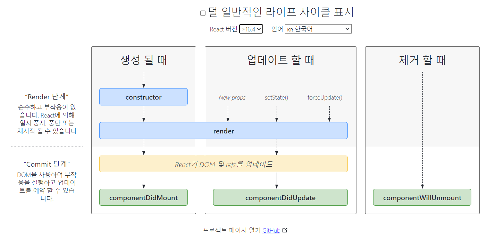

### react 클래스형 컴포넌트로 만들기
- class형 컴포넌트
  - 라이프 사이클 기능이 구현
  - state 관리 기능이 구현
  - Component로 상속받음
  - render() 함수로 jsx를 반환
  - props를 조회할 때 this를 사용
  - 커스텀 메서드를 만들 때 클래스의 생성자 메서드 constructor에서 bind를 해준다.
  ```jsx
  export default class AddTodo extends Component {
  constructor(props) {
    super(props);
    this.state = { item: { title: "" } };
    this.add = props.add;
    // props의 함수를 this.add에 연결, props에는 상위 컴포넌트(App.js)의 함수, 매개변수가 들어있다.
  }
  ```
  - state를 선언할때는 constructor 내부에서 this.state 설정.
  - 클래스형 컴포넌트의 state는 무조건 객체형태.
  - state를 조회할때는 this.state를 조회
  - 상태 업데이트 시 this.setState함수 사용
  - 생명주기(https://projects.wojtekmaj.pl/react-lifecycle-methods-diagram/)
  
  1. 마운트 단계
    - constructor : 컴포넌트가 만들어지면 가장 먼저 실행. render 전에 호출
    - getDerivcedStateFromProps : props로 받아온 것을 state에 넣고싶을 때 사용
    - render : 컴포넌트를 렌더링 하는 메서드. 서버와 통신, 쿠기 저장 등은 여기서 하면 안된다.
    - conponentDidMount : render 메서드의 첫 번째 반환값이 실제 돔에 반영된 직후 호출. axios, fetch등 외부 api 호출
  2. 업데이트
    - getDerivedStateFromProps : 컴포넌트의 props나 state가 바뀌었을 때 호출
    - shouldComponentUpdate : 컴포넌트가 리렌더링 할지 말지 결정
    - render : 컴포넌트를 렌더링
    - getSnapshotBeforeUpdate : 렌더링 결과가 실제 돔에 반영되기 직전 호출. 이전 돔 상태값 가져오기 좋다.
    - componentDidUpdate : 가상 돔이 실제 돔에 반영된 후 호출. 새로 반영된 돔의 상태값을 가장 빠르게 가져올 수 있는 메서드.
  3. 언마운트
    - componentWillUnmount : 컴포넌트가 화면에서 사라지기 직전에 호출
- 함수형 컴포넌트
  - hook을 통해 라이프 사이클 기능과 state 기능을 구현
  - jsx를 return문을 사용해서 반환
  - class보다 메모리 자원을 덜 사용함
  - 과거에는 state와 라이프사이클을 사용할 수 없었음